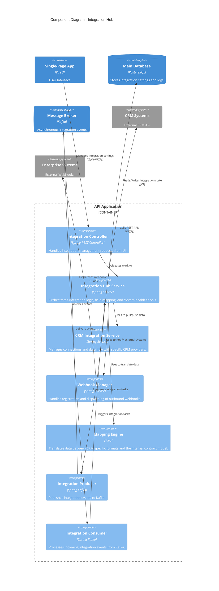

# Component Diagram - Integration Hub

The Component diagram for the Integration Hub shows the internal structure of the integration-related functionality within the API Application.

## Components

| Component | Technology | Description |
|-----------|------------|-------------|
| **Integration Controller** | Spring REST | REST API endpoints for configuring integrations and monitoring logs. |
| **Integration Hub Service** | Spring Service | Orchestrator for all integration workflows (Pull, Push, Replay). |
| **CRM Integration Service** | Spring Service | Handles provider-specific logic and OAuth2 token management. |
| **Webhook Manager** | Spring Service | Manages registration, signing, and reliable delivery of outbound webhooks. |
| **Mapping Engine** | Java | Core logic for mapping external CRM fields to internal contract metadata. |
| **Integration Producer/Consumer** | Spring Kafka | Enables reliable, asynchronous integration processing. |
