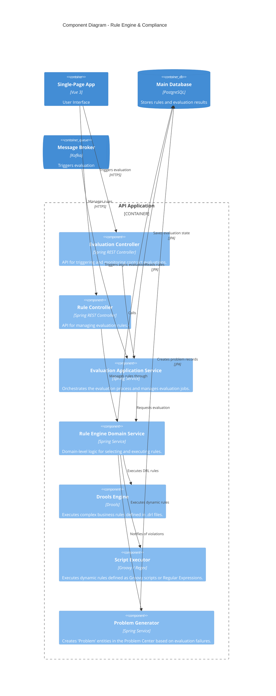

# Component Diagram - Rule Engine & Compliance

The Component diagram for the Rule Engine shows how contract compliance is evaluated using dynamic rules.

## Components

| Component | Technology | Description |
|-----------|------------|-------------|
| **Evaluation Service** | Spring Service | Manages the lifecycle of evaluation jobs and async execution. |
| **Rule Engine Service** | Spring Service | The core logic for rule execution, supporting multiple rule types. |
| **Drools Engine** | Drools | High-performance production rule engine for complex logic. |
| **Script Executor** | Groovy/Regex | Lightweight executors for user-defined dynamic logic. |
| **Problem Generator** | Spring Service | Integration point between evaluation results and the Problem Center. |
