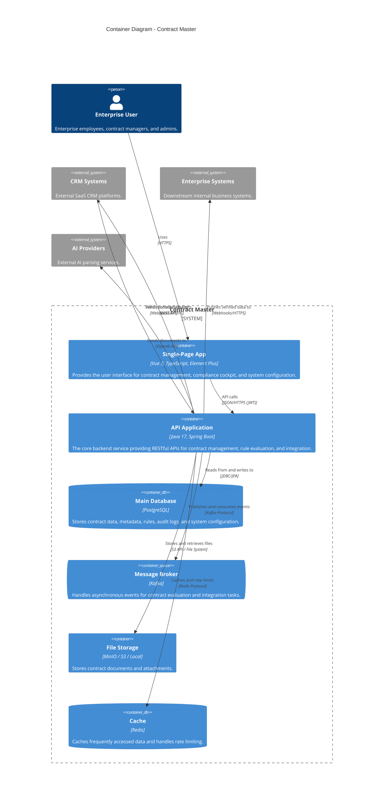

# Container Diagram - Contract Master

The Container diagram shows the high-level technical building blocks of the Contract Master system.

## Containers

| Container | Technology | Description |
|-----------|------------|-------------|
| **Single-Page App** | Vue 3, Vite, Element Plus | Modern web interface for all user interactions. |
| **API Application** | Java 17, Spring Boot 3.2.x | Core backend service following DDD principles. |
| **Main Database** | PostgreSQL | Relational database for persistent storage. |
| **Message Broker** | Kafka | Asynchronous messaging for decoupling evaluation and integration tasks. |
| **File Storage** | MinIO / S3 / Local | Storage for unstructured contract documents. |
| **Cache** | Redis | High-performance distributed cache. |
