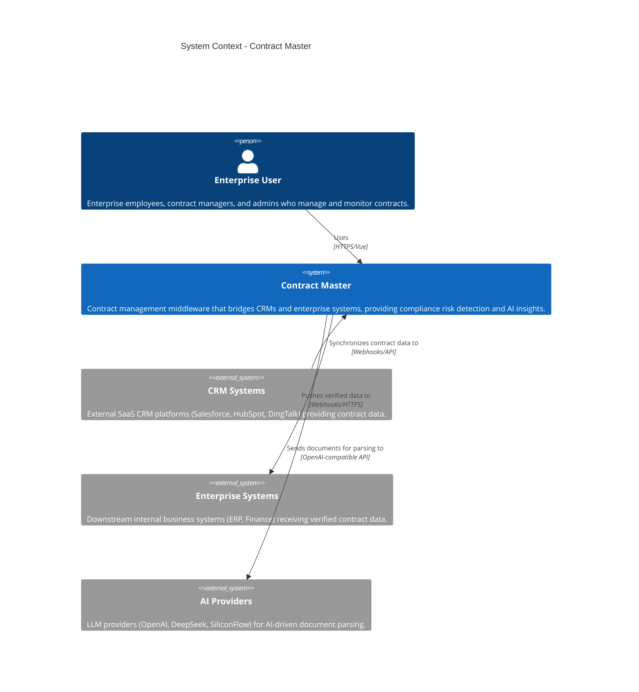

# System Context Diagram - Contract Master

The System Context diagram provides a high-level view of the Contract Master system and its interactions with users and external systems.

## Elements

| Element | Description |
|---------|-------------|
| **Enterprise User** | Users who interact with the system to manage contracts, define rules, and monitor compliance. |
| **Contract Master** | The central system for contract lifecycle management, rule evaluation, and AI insights. |
| **CRM Systems** | Sources of contract data that trigger integration flows. |
| **Enterprise Systems** | Destinations for verified and standardized contract data. |
| **AI Providers** | External services that provide advanced AI capabilities for document extraction and analysis. |
