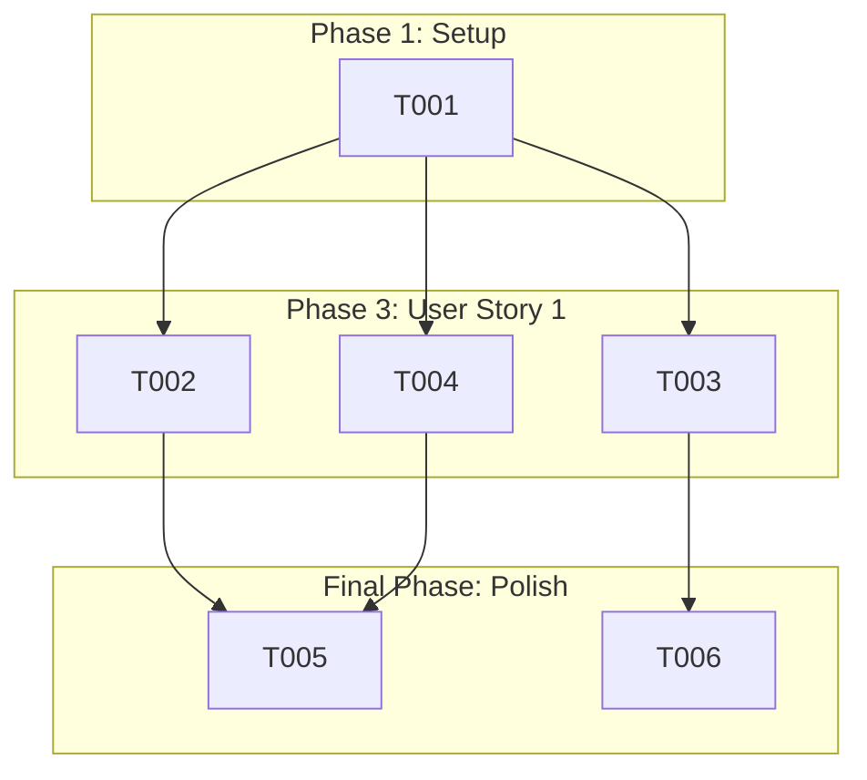

# Actionable Tasks: Simplify Backend Logs

This file breaks down the feature "Simplify Backend Logs" into a dependency-ordered list of tasks.

## Phase 1: Setup

- [X] T001 Locate the `logback-spring.xml` file in `backend/src/main/resources`.

## Phase 2: Foundational Tasks

*No foundational tasks required for this feature.*

## Phase 3: User Story 1 - Simplified Log Viewing

**Goal**: As a developer or operator, I want to see only ERROR level logs by default to reduce log noise and quickly identify critical issues in the production environment.

**Independent Test**: After deploying the change, run a standard set of operations and verify that the log output only contains ERROR level messages.

- [X] T002 [US1] Modify `logback-spring.xml` to set the root logging level to `ERROR` for the `production` profile.
- [X] T003 [US1] Modify `logback-spring.xml` to add a `development` profile with `INFO` as the root level and `DEBUG` for the `com.contract.master` package.
- [X] T004 [US1] In the `production` profile, ensure that Hibernate/SQL logs are suppressed by setting the level for `org.hibernate` to `OFF`.

## Final Phase: Polish & Cross-Cutting Concerns

- [X] T005 Verify the changes by running the application with the `production` profile and confirming that only ERROR logs are present.
- [X] T006 Verify the changes by running the application with the `development` profile and confirming that DEBUG and INFO logs are present.

## Dependency Graph

## Parallel Execution

- Tasks within Phase 3 can be executed in parallel as they all modify the same file but are logically independent changes.

## Implementation Strategy

The implementation will be done in a single pass, as the changes are all in a single configuration file. The MVP is the completion of all tasks.
